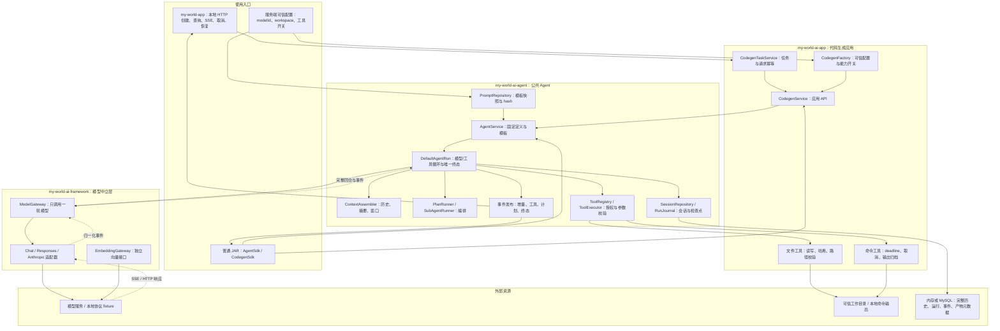
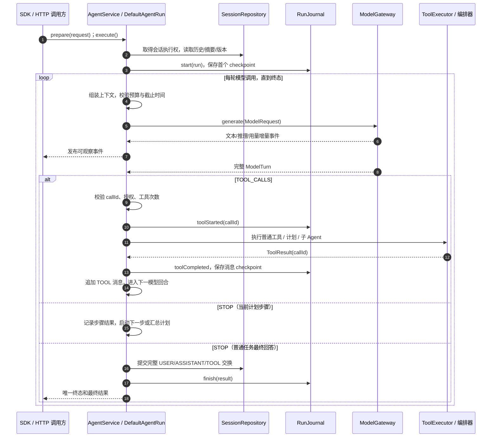
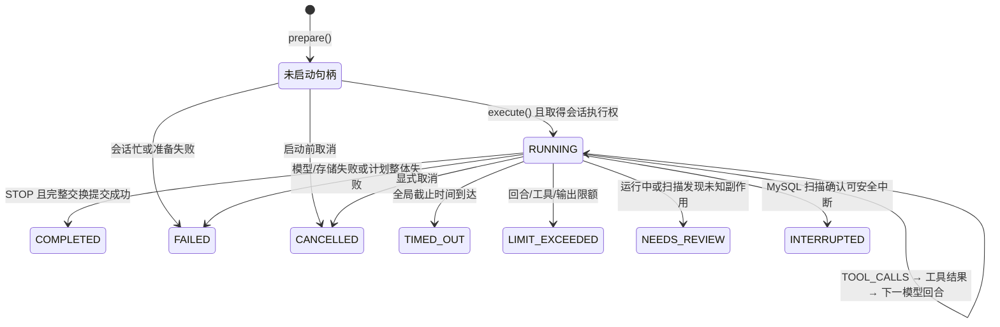
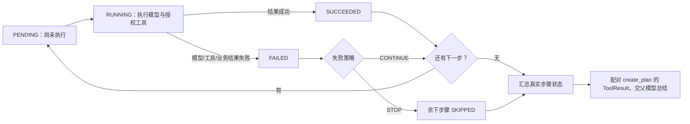
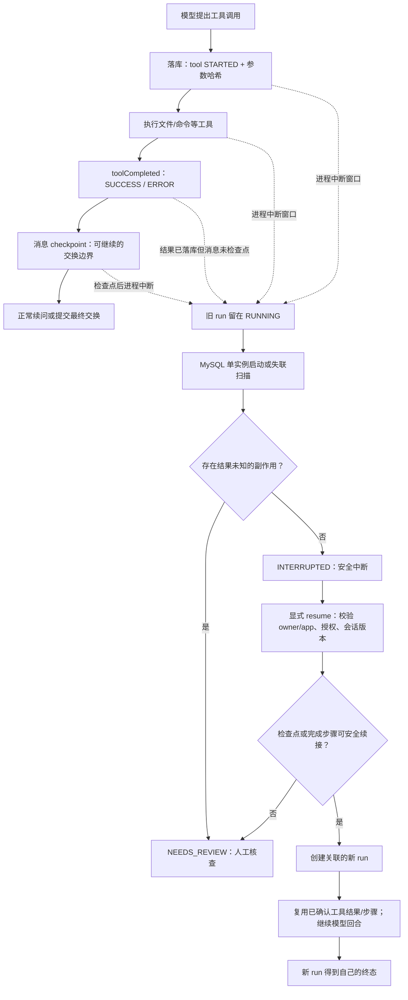

# myWorld 自研 AI Framework 与 Agent：项目总结及面试问答

> 整理日期：2026/10/05。本文依据当前仓库源码、测试和 `docs/agent-blueprint` 阶段记录整理，适合面试陈述、技术考核和述职。文中的“效果”指代码具备的行为及现有测试所证明的结果；没有吞吐、成本节省或真实模型准确率的实测数据，不把这些指标写成项目成果。个人贡献的具体归属应结合实际分工陈述。

## 一、项目定位与我的工作范围

myWorld 是 Java 21、Spring Boot 3 的多模块项目。AI 相关部分的目标，是把模型调用、工具执行、Agent 编排、会话与恢复做成可复用能力，并用代码生成场景检验完整链路。项目参考 Agent4J 的能力清单，但在本仓库形成独立的模块与实现；不能把参考项目原有功能、Spring AI 的现成能力，直接算作本项目自研成果。

| 模块 | 本项目职责 | 核心边界 |
|---|---|---|
| `my-world-ai-framework` | 模型中立消息、单轮调用契约、协议适配、Embedding | `ModelGateway` 只完成一次模型调用，不执行 Java 工具或 Agent 循环 |
| `my-world-ai-agent` | Agent 定义、运行循环、工具、计划、子 Agent、记忆、会话、持久化、恢复与事件 | 统一控制模型续问与副作用边界，对外提供 `AgentService` / `AgentSdk` |
| `my-world-ai-app` | 代码生成应用、文件/命令工具、可信工作目录和应用配置 | 按配置授予能力，HTTP 请求不能自行扩大权限 |
| `my-world-app` | Spring Boot 启动与本地开发 Web 入口 | 提供任务创建、查询、SSE、取消、显式恢复 |
| `my-world-ai` | 既有 Spring AI 接入 | 与上述自研单轮模型契约分开，述职时应单独说明 |

**30 秒陈述**：我在项目里构建了可复用的模型中立 Agent 运行时。模型协议层把 Chat Completions、Responses、Anthropic 的流事件归一为单轮结果；Agent 层统一处理工具调用、权限、预算、会话、计划与子任务；代码生成场景通过受控文件和命令工具完成“生成—编译—读取错误—修正—再验证”。针对长任务与副作用，我增加了历史压缩、数据库检查点和保守恢复，明确把结果未知的文件/命令操作交给人工核查。

## 二、系统设计：为什么这样分层

### 总图：从入口到模型、工具和存储

先看 **Agent 运行时**：它接收任务和可信配置，调用单轮模型与已授权工具，并保存会话和检查点。实线箭头表示调用或数据流，虚线箭头表示模型结果回传；框名对应 Maven 模块。`my-world-ai` 的独立 Spring AI 接入未参与这条自研 Agent 链路。

核心取舍是**把“模型生成一轮”与“Agent 决定下一步”分开**。协议适配器负责请求编码、SSE 聚合、工具调用片段和用量归一；Agent 运行时负责是否执行工具、如何续问、何时终止。这样增加协议时不用复制一套工具循环，增加应用工具时不用改供应商适配器。入口契约见 [`ModelGateway`](../my-world-ai-framework/src/main/java/com/dingbang/myworld/aiframework/api/ModelGateway.java) 与 [`DefaultAgentRun`](../my-world-ai-agent/src/main/java/com/dingbang/myworld/agent/runtime/DefaultAgentRun.java)。

一次正常工具回合是：固定可信定义和模板快照 → 取得会话租约与历史 → 组装 `SYSTEM + 摘要/历史 + USER` → 调用单轮模型 → 聚合完整 `ASSISTANT` 工具调用 → 检查整批 `callId`、权限和预算 → 逐项执行并写入配对的 `TOOL` 结果 → 再次请求模型 → 将完整交换提交会话 → 发布唯一终态。用户输入始终是 `USER`，不会因为提示词内容而升级为系统指令；系统模板和工具授权来自服务端定义。

### 分图 1：一次工具任务如何从请求走到终态

这张图按时间从上到下读。`loop` 是 Agent 核心：模型每次只生成一轮，运行时决定续问；`alt` 是模型给出工具调用或最终回答的两条路径。计划和子 Agent 是工具调用分支内由运行时接管的特殊工具。

图中的增量事件只供实时展示；会话历史以完整 `ModelTurn` 和配对的 `ToolResult` 为准。任何时刻的取消、超时、限额或失败都可打断循环并竞争唯一终态。执行中的计划步骤仍使用同一运行预算；子 Agent 有独立会话，但只能获得父级授权工具的子集。

### 项目里的状态机及流转

这里有五层相关状态。**`AgentResultStatus` 是对外运行状态；`ModelFinishReason` 是单轮模型的分支条件；`ToolExecutionPhase` 与 `PlanStepStatus` 分别描述工具和计划步骤；数据库的 `STARTED/结果已确定` 记录用于故障恢复。** `CodegenTaskState` 只是包装 Agent 状态、结果和产物，不另造一套任务状态机；子 Agent 复用同一个 Agent 运行状态机，但有独立 `runId/sessionId`。

| 层次 | 状态或分支 | 谁推进、何时转换 |
|---|---|---|
| Agent 运行 | `RUNNING` → `COMPLETED / FAILED / CANCELLED / TIMED_OUT / LIMIT_EXCEEDED / NEEDS_REVIEW` | `execute()` 取得会话执行权并记录运行起点；完整回答且会话提交成功才 `COMPLETED`。失败、显式取消、全局超时、预算耗尽或未知副作用分别进入对应终态。只有 MySQL 的重启/失联扫描还会把遗留 `RUNNING` 标为 `INTERRUPTED` 或 `NEEDS_REVIEW`。`prepare()` 只是未启动句柄，不是持久化的 `PENDING`。 |
| 单轮模型 | `STOP / TOOL_CALLS / LENGTH / REFUSAL / UNKNOWN` | 完整 `ModelTurn` 到达后，`TOOL_CALLS` 进入工具或编排分支并续问；`STOP` 进入最终回答或完成当前计划步骤；`LENGTH` 转运行限额；其他非正常结束走模型失败处理。流中的文本 delta 只是事件，不等于完整回合。 |
| 工具阶段 | `PREPARING` → `CALLING` → `COMPLETED / FAILED` | `ToolExecutor` 先查授权与解析参数；非法参数可直接从 `PREPARING` 到 `FAILED`，并返回配对错误。取消/超时属于运行控制，可能直接结束 Agent，不保证再有工具 `FAILED` 阶段事件。 |
| 计划步骤 | `PENDING` → `RUNNING` → `SUCCEEDED / FAILED`；未执行的后续步骤可 `SKIPPED` | `PlanRunner.startNext()` 启动步骤；模型或工具真实结果决定完成状态。`STOP` 策略遇失败将剩余步骤标为 `SKIPPED`；`CONTINUE` 继续后续步骤，但整体计划仍失败。计划结果作为原 `create_plan` 的工具结果回父模型，最终运行不能被父模型一句“完成”改写成成功。 |
| 工具持久化与恢复 | `STARTED` → `SUCCESS / ERROR`；旧 `RUNNING` → `INTERRUPTED / NEEDS_REVIEW` | 调用外部工具前先落意图，结果确定后才落工具结果。重启时若存在未知非计划工具副作用，旧 run 进 `NEEDS_REVIEW`；安全中断进 `INTERRUPTED`。`resume()` 仅接收可安全恢复的 `INTERRUPTED`，创建关联的**新 run**，旧 run 不回到 `RUNNING`。 |

### 分图 2：Agent 运行与计划步骤的状态流转

第一张是**整个 run 对调用方可见的状态**。`prepare()` 后尚无持久化的 `PENDING`；`execute()` 才竞争执行权。`RUNNING` 中的自环代表多个模型/工具回合，所有终态对同一 run 都不可逆。

第二张只看**一份顺序计划中的单个步骤**。`SUCCEEDED` 表示该步骤结果已确认；即使 Java 命令工具成功返回，真实退出码非零仍可使步骤进入 `FAILED`。失败后的 `CONTINUE` 可以继续执行后续步骤，但整体计划不会变成成功。

其中“模型回合事件”也有约束：增量事件后必须收到唯一 `TurnCompleted`，之后才能正常 `onComplete`；缺完整回合、完整回合后继续发业务事件或重复终态都由 `ValidatingModelEventListener` 拦截。Agent 的 `terminal` 标志在锁内竞争唯一终态，迟到模型回调和工具事件不再改变结果。会话租约与版本校验是转换的**守卫条件**，不是额外的运行状态。实现入口见 [`DefaultAgentRun`](../my-world-ai-agent/src/main/java/com/dingbang/myworld/agent/runtime/DefaultAgentRun.java)、[`PlanRunner`](../my-world-ai-agent/src/main/java/com/dingbang/myworld/agent/orchestration/PlanRunner.java)、[`ValidatingModelEventListener`](../my-world-ai-framework/src/main/java/com/dingbang/myworld/aiframework/api/event/ValidatingModelEventListener.java) 和 [`MybatisRunService`](../my-world-ai-agent/src/main/java/com/dingbang/myworld/agent/persistence/mybatis/MybatisRunService.java)。

### 分图 3：数据库检查点与中断恢复

图中只有 `INTERRUPTED` 可进入项目提供的显式 `resume()`。`NEEDS_REVIEW` 代表副作用是否发生仍不确定，必须先核查；数据库请求 ID 唯一约束不能解决这一点。恢复会创建新的 `runId` 并关联旧 run，不修改旧 run 的终态。

## 三、核心功能：问题、方法、效果与证据

### 1. 模型协议与流事件

**问题**：不同供应商的角色、工具调用、推理字段、结束原因和 SSE 事件格式不同；流中工具参数可能分片、多个调用交错，直接把原始 SSE 交给 Agent 会造成不完整调用或重复执行。

**方法**：定义 `Message`、`ModelRequest`、`ModelTurn`、`ModelEvent` 等中立对象；由 [`OpenAiChatGateway`](../my-world-ai-framework/src/main/java/com/dingbang/myworld/aiframework/protocol/openai/OpenAiChatGateway.java) 和 [`MultiProtocolGateway`](../my-world-ai-framework/src/main/java/com/dingbang/myworld/aiframework/protocol/MultiProtocolGateway.java) 适配 Chat、Responses、Anthropic；按 `modelId` 通过 [`RoutedModelGateway`](../my-world-ai-framework/src/main/java/com/dingbang/myworld/aiframework/protocol/RoutedModelGateway.java) 路由。保留协议所需的 reasoning/签名等元数据，并用显式能力开关控制图片、推理字段等组合；不支持的媒体类型提前拒绝。Embedding 另设 `EmbeddingGateway`，避免把向量生成误当成聊天轮次。

**效果与证据**：本地 HTTP/SSE fixture 覆盖工具续问、图片、usage、断流、HTTP 错误、取消与调用选项隔离，见 `OpenAiChatGatewayTest`、`MultiProtocolGatewayTest`、`HttpEmbeddingGatewayTest`。这些是离线协议验证，**尚无真实供应商兼容性与性能结论**。

### 2. Agent 循环与可控终态

**问题**：循环调用模型和工具容易无限续问；取消、超时、观察者异常与迟到的模型回调可能竞争，造成双终态、额外工具副作用或资源泄漏。

**方法**：[`DefaultAgentRun`](../my-world-ai-agent/src/main/java/com/dingbang/myworld/agent/runtime/DefaultAgentRun.java) 统一管理运行状态和调度；可信 [`AgentLimits`](../my-world-ai-agent/src/main/java/com/dingbang/myworld/agent/api/AgentLimits.java) 控制模型回合、工具次数、输出字符、事件容量、总时限、计划步骤与子 Agent 深度。每次启动工具前复核时限、取消和会话租约；所有成功、失败、取消、超时、限额路径竞争同一个终态。有限事件历史和每订阅者有界队列避免慢消费者无限占内存；历史缺口显式报错。

**效果与证据**：`AgentRunControlTest` 覆盖取消传播、迟到回调、唯一终态、工具停止、时限及用量去重；`AgentEventPublisherTest` 验证回放和订阅边界。预算是运行时硬边界，但 token 数本身仍依赖估算与供应商上报，不能宣称实时精确 token 截断。

### 3. 工具注册、参数校验与安全回传

**问题**：模型产生的工具名和 JSON 参数不可直接信任；参数不合法时如果已经执行 Java 工具，就可能产生不可逆副作用；工具结果还必须与原调用一一配对。

**方法**：[`ToolDescriptor`](../my-world-ai-agent/src/main/java/com/dingbang/myworld/agent/tool/ToolDescriptor.java) 从注解生成 JSON Schema，要求参数说明、类型与必填项，并拒绝额外字段；[`ToolRegistry`](../my-world-ai-agent/src/main/java/com/dingbang/myworld/agent/tool/ToolRegistry.java) 冻结运行级授权快照；[`ToolExecutor`](../my-world-ai-agent/src/main/java/com/dingbang/myworld/agent/tool/ToolExecutor.java) 先校验、再执行。参数错误转换为带原 `callId` 的 `TOOL_VALIDATION_ERROR`，模型可据此修正；取消和超时作为控制信号上抛。会话提交前由 [`SessionHistoryValidator`](../my-world-ai-agent/src/main/java/com/dingbang/myworld/agent/session/SessionHistoryValidator.java) 检查 `USER → ASSISTANT(tool_calls) → TOOL(callId) → ASSISTANT` 的完整性。

**效果与证据**：`ToolExecutorTest` 与 `AgentToolLoopTest` 覆盖非法参数不执行工具、同轮多调用及错误回传修正；`OpenAiChatAgentIntegrationTest` 将该闭环延伸到本地 SSE 协议。

### 4. 计划与子 Agent 编排

**问题**：多步骤任务若只让模型口头列计划，后一步不一定拿到前一步的产物，编译失败也可能被误报为完成；子 Agent 若直接继承父工具和历史，会造成越权与上下文污染。

**方法**：`create_plan` 生成不可变计划，[`PlanRunner`](../my-world-ai-agent/src/main/java/com/dingbang/myworld/agent/orchestration/PlanRunner.java) 按步骤顺序推进，显式把前序结果和产物写入下一步上下文；用 `SUCCEEDED/FAILED/SKIPPED` 及 `STOP/CONTINUE` 表示程序状态，步骤中禁止递归创建计划。命令退出码非零由 `PlanStepOutcome` 判为步骤失败，不能仅凭工具 Java 调用成功判断任务成功。`create_sub_agent` 创建独立 `runId/sessionId`，仅允许父运行已授权工具的子集；未指定工具时子任务无工具。子任务接收委派任务和显式上下文，不复制父历史，父取消会传播，父子用量按模型调用 ID 去重汇总。

**效果与证据**：`PlanExecutionTest` 覆盖步骤依赖、失败策略、递归与共享预算；`SubAgentExecutionTest` 覆盖权限收缩、独立历史、深度、单线程执行器和取消；`CodegenServiceTest` 覆盖只读子 Agent 审查代码。当前计划是**顺序步骤**，子任务也是受控委派，不宣称 DAG 或并行调度。

### 5. 上下文窗口、摘要与运行中压缩

**问题**：多轮对话和长工具输出会占满模型窗口；简单截断可能删掉工具结果配对、最新用户要求或重要错误；如果摘要直接替代原始记录，会降低可审计性。

**方法**：[`ContextAssembler`](../my-world-ai-agent/src/main/java/com/dingbang/myworld/agent/memory/ContextAssembler.java) 按交换边界选取上下文；达到轮次或估算 token 阈值时，使用无工具摘要调用生成 `MemorySummary`，只记录覆盖位置，**不删除原始历史**。运行中还会对较旧的成功工具输出做有损裁剪，保留首尾、标记省略，保护最新工具批次、系统消息、用户要求及错误内容；若仍超窗则明确返回 `CONTEXT_WINDOW_EXCEEDED`。[`CalibratedTokenEstimator`](../my-world-ai-agent/src/main/java/com/dingbang/myworld/agent/memory/CalibratedTokenEstimator.java) 用足够大的供应商输入用量样本校准字节估算，并留安全余量。

**效果与证据**：`ContextMemoryTest` 覆盖摘要触发、覆盖位置、导出恢复、工具交换边界与超窗；`ContextCompactionTest` 验证压缩后可继续运行且存储历史不变；`CalibratedTokenEstimatorTest` 验证样本阈值和比例校准。估算器不等于供应商 tokenizer，摘要也是有损表达，需保留原文供审计与重新读取。

### 6. 会话、持久化与保守恢复

**问题**：Agent 会话不能只存最终文本，工具续问依赖完整 `callId` 历史；进程可能恰好在“文件已写入、结果未落库”时中断，数据库事务也不能回滚文件系统或 shell 副作用。

**方法**：会话保存完整交换、摘要、版本和 owner/app/Agent 归属；MySQL 模式由 [`MybatisSessionService`](../my-world-ai-agent/src/main/java/com/dingbang/myworld/agent/persistence/mybatis/MybatisSessionService.java) 与 [`MybatisRunService`](../my-world-ai-agent/src/main/java/com/dingbang/myworld/agent/persistence/mybatis/MybatisRunService.java) 保存运行、事件、工具意图/结果、计划步骤及产物元数据，Flyway 负责表结构。会话租约配合版本条件更新，防止同一会话并发写入；工具前再次确认租约。工具调用前写 `STARTED`，结果确定后写完成并推进检查点。重启扫描标记旧运行中断；显式 `resume` 重新校验归属、权限和会话版本，已确认的工具结果可以复用，未知副作用进入 `NEEDS_REVIEW`，不盲目重跑。

**效果与证据**：`MybatisMysqlPersistenceTest` 曾在真实 MySQL 8.0 测试库覆盖跨上下文历史、租约、冲突、检查点及待核查状态；`JdbcPersistenceRecoveryTest` 用测试目录中的 H2/JDBC 旧实现覆盖故障窗口。后续 S20/S21 的全量构建没有重跑真实 MySQL 条件测试；最新新增的请求键查询也还缺真实 MySQL 复验。**这里实现的是安全边界恢复，不是外部副作用 exactly-once。**

### 7. 代码生成应用：把通用能力落到可验证任务

**问题**：模型生成代码后可能编译失败；文件写入可能越界、覆盖用户修改，命令长输出可能阻塞或撑爆上下文；直接向 HTTP 用户开放 workspace/命令开关会扩大权限。

**方法**：[`CodegenFactory`](../my-world-ai-app/src/main/java/com/dingbang/myworld/aiapp/codegen/application/CodegenFactory.java) 按服务端配置组装只读文件工具、写工具、命令、计划和子 Agent。[`WorkspacePolicy`](../my-world-ai-app/src/main/java/com/dingbang/myworld/aiapp/codegen/tool/WorkspacePolicy.java) 固定真实工作目录，拒绝绝对路径、越界及符号链接；文件读取带 SHA-256，编辑/移动/删除要求读取时哈希，拒绝过期版本与目标覆盖。`view_file` 支持按行和 Java 符号定位，重载时返回候选，减少把整个大文件送入模型。命令工具从启动时计算 deadline、仅传允许的环境变量、并发读取输出、支持父取消和进程树清理；长输出归档后可用 `outputId` 按会话分页读取。HTTP 入口只接受任务、请求 ID 和可选会话 ID，不能由请求选择工作目录、模板或工具。

**效果与证据**：`CodegenCommandLoopTest` 用确定性假模型跑通创建 Java 文件 → 首次 `javac` 失败 → 查看文件哈希并修正 → 编译/运行成功；`FileToolsTest` 覆盖越界、链接、并发修改、符号读取；`ExecuteCommandToolTest` 覆盖输出界限、归档、超时、取消和进程清理；`CodegenControllerTest` 覆盖本地入口与 SSE。工作目录限制**不是 OS 沙箱**，shell 仍可能访问工作目录外资源；正式多用户部署需要独立进程/容器隔离与身份系统。

### 8. 可复用 SDK、提示词与可观测性

**问题**：若业务方必须依赖具体供应商客户端或整个 Web 应用，Agent 难复用；流式观察者慢或断连也不应改变任务结果；排障日志若打印提示词与工具输出会泄露数据。

**方法**：`AgentSdk` 和 `CodegenSdk` 提供普通 JAR 消费入口；提示词用资源文件和 `PromptTemplateRegistry` 按“项目覆盖 > 应用覆盖 > 默认”加载为不可变快照，记录内容 hash。任务 API 支持创建、状态/产物查询、结构化 SSE 事件回放、显式取消和安全边界恢复；SSE 断开不自动取消后台任务。`RunAuditInterceptor` 用 `runId/traceId/parentRunId/modelCallId/callId` 关联模型、工具、父子运行，记录耗时和 `usageStatus=unknown/partial/reported`；`SafeModelDebugGateway` 默认关闭，只记录脱敏元数据。

**效果与证据**：[`examples/sdk-consumer`](agent-blueprint/examples/sdk-consumer/) 的独立 Maven 消费者证明可作为普通依赖运行；`CodegenControllerTest`、`RunAuditInterceptorTest` 验证任务入口、事件及审计。`ToolExecutor` 另有工具失败消息的有限长度日志预览，部署时仍应评估其中是否可能包含敏感异常文本，不能笼统声称所有日志绝无业务内容。

## 四、最值得展示的一条完整案例

以“生成一个可运行的 Java 程序”为例，面试时可按以下顺序讲清楚**决策权与证据链**：

1. 服务端先固定 `modelId`、工作目录、工具集合、时限和输出预算；请求只能提供任务内容。
2. 模型提出 `create_file`；运行时校验工具授权与 JSON 参数，文件工具检查相对路径、符号链接和目标状态，写入后返回产物哈希。
3. 模型提出 `execute_command(javac ...)`；命令工具返回真实退出码和受控输出。首次编译失败属于业务步骤失败，计划不能把它标成成功。
4. 模型读取文件及 SHA-256，依据编译错误提出 `edit_file`；旧哈希若已过期就拒绝写入，防止覆盖并发修改。
5. 再次编译、运行成功后，运行时保存完整消息交换、工具结果和产物元数据，并发出终态；调用方可以按 `runId` 查状态和事件。

这里的“能纠错”是**确定性假模型测试中的能力证明**，不是对任意真实模型任务成功率的统计。对应测试为 `CodegenCommandLoopTest.planCarriesCompileFailureIntoCorrectionStep` 及同类生成闭环测试。

## 五、面试 / 考核高频问答

### Q1：为什么不直接使用 Spring AI 的 Agent 或把循环写在每个模型适配器里？

**答**：项目需要明确的单轮协议边界与运行级治理。`ModelGateway` 只负责“给定消息，返回一次完整模型回合”；工具、计划、权限、预算、取消和恢复由同一 Agent 运行时处理。这样多协议共用一套状态机，也便于用脚本模型验证 Agent 行为。仓库中独立的 `my-world-ai` 模块仍可承担 Spring AI 接入，不把二者混为一谈。

### Q2：流式工具调用为什么不能收到一段 JSON 就立即执行？

**答**：参数和调用标识可能拆在多个 SSE 分片，甚至多个工具调用交错。必须按协议聚合到完整 `ModelTurn`，校验结束原因、`callId` 唯一和参数完整性，才让 Agent 执行。否则可能用半截参数触发副作用，或把结果回给错误的调用。

### Q3：模型输出了未授权工具名，系统如何处理？

**答**：模型可见工具来自可信定义的授权快照；执行时仍由 `ToolExecutor` 在同一注册表查找。查不到就返回 `TOOL_NOT_FOUND`，不会反射调用任意 Java 方法。子 Agent 只能再从父授权集合中选子集，因此不能通过委派扩大权限。

### Q4：为什么参数错误要作为 `TOOL` 消息回给模型？哪些错误不能这样处理？

**答**：非法 JSON、缺少必填字段等属于模型可修正错误，返回同一 `callId` 的结构化错误可让下一轮重试正确参数。取消、超时和租约失效是运行控制问题，不能当作普通工具失败继续生成；可能已发生副作用的工具异常也应转入待核查，而不是自动重放。

### Q5：如何保证历史消息可以被协议适配器再次发送？

**答**：只把完整交换提交会话，`SessionHistoryValidator` 检查 USER/ASSISTANT/TOOL 顺序和每个工具 `callId` 一一对应；未完成交换先留在运行检查点。这样下一次会话请求拿到的历史不会缺工具结果或含游离 `TOOL` 消息。

### Q6：计划失败由谁判定？模型最后说“完成”算成功吗？

**答**：程序按步骤真实状态判定。`PlanRunner` 记录成功、失败和跳过，`STOP/CONTINUE` 决定后续步骤；编译命令即使 Java 工具本身正常返回，只要退出码非零，`PlanStepOutcome` 仍判步骤失败。模型的自然语言总结不能覆盖程序状态。

### Q7：子 Agent 为什么要独立会话？怎样防止无限递归或预算绕过？

**答**：独立会话使子任务只看委派任务与显式上下文，避免父历史和权限泄漏；父级只接收与委派 `callId` 配对的结果。创建时缩小工具集合，并把剩余模型回合、工具次数、输出字符、时限及层级上限传给子级；父取消继续传播到子运行。父子用量按模型调用 ID 去重，避免汇总双算。

### Q8：如何解决上下文变长，同时不破坏工具调用语义？

**答**：长期历史按完整交换边界做摘要，保存覆盖位置但不删原文；当前运行的旧成功工具结果可有损裁剪，同时保留最新工具批次、错误与 `callId`。生成前估算输入和回答预留，无法压到窗口内就明确拒绝。这比随意删除最近几条消息安全，但摘要与裁剪都可能丢细节，所以仍可按来源重读。

### Q9：token 估算与 `usage` 有什么区别？能否做到精确限额？

**答**：估算用于请求前窗口判断，项目以字节估算并用足够大的供应商输入用量样本校准；`usage` 是供应商在请求过程中或结束时报告的实测值。未报告时记 `unknown`，部分报告记 `partial`，不把缺失值当零。精确实时 token 限额取决于供应商能力，项目当前只能结合预估、输出字符、模型输出上限和截止时间控制。

### Q10：同一个会话被两个请求同时写入会怎样？

**答**：内存或 MySQL 会话都要取得执行权；MySQL 用租约和版本条件更新，提交时必须匹配预期版本与当前持有者。模型网络等待不长期占数据库事务；工具执行前重新验证租约。冲突请求不会静默覆盖历史，恢复时也检查版本是否仍匹配。

### Q11：请求 ID 唯一约束为什么不等于工具 exactly-once？

**答**：它只能防止数据库中重复创建同一请求记录。文件写入或命令执行发生在数据库事务之外，进程可能在外部操作成功、结果记录未提交时崩溃。此时数据库看不出副作用是否已完成，所以重试会有重复执行风险；实现选择 `NEEDS_REVIEW`，不承诺 exactly-once。

### Q12：哪些故障点可以自动继续，哪些必须人工核查？

**答**：已记录完整工具结果但尚未推进消息检查点时，可以补齐结果而不再次执行；已完成的计划步骤可以从下一步骤边界继续。工具只写了 `STARTED`、文件/命令结果未知，或计划步骤正在执行、附件原请求无法完整还原、会话版本已变化时，不能安全自动重放。`resume` 始终显式创建关联的新 run。

### Q13：为什么代码生成工具既要限制路径又要校验 SHA-256？

**答**：路径策略控制能操作哪里；SHA-256 控制“我修改的是否仍是刚才看到的版本”。两者解决不同风险。真实根目录、相对路径规范化和逐级链接检查拦截常见越界；编辑/移动/删除要求旧哈希，能拒绝过期写入。它不能抵御所有文件系统竞态，也不是 shell 的 OS 隔离。

### Q14：命令输出持续增长、没有换行且进程不退出，如何避免卡死？

**答**：从进程启动时计算 deadline，另起读取线程并发消费标准输出/错误合并流，模型可见内容有上限；完整较长输出按会话归档，用 `outputId` 分页读取。取消或超时会尝试清理进程树。受限平台若不能枚举子进程，只能保证直接进程清理，不能夸大为完整容器级治理。

### Q15：为什么 SSE 客户端断开后任务默认继续？

**答**：HTTP 连接是观察通道，Agent run 是独立任务。客户端网络波动不应自动撤销已经产生文件/命令副作用的任务；用户可按 `runId` 重连、回放事件或显式取消。内存事件历史有限，历史缺口需明确提示；MySQL 模式可以按序查询持久化事件。

### Q16：Embedding 已有了，是否意味着项目已经具备 RAG？

**答**：没有。现在有文本及部分多模态输入的向量生成契约、协议适配与结果校验，但没有完成切分、索引、向量库、召回、重排和带引用的生成链路。述职可说“具备 Embedding 基础能力”，不能说“已实现 RAG”。

### Q17：你如何验证这些设计确实有效？

**答**：按层使用脚本模型、临时文件工作目录、本地 HTTP/SSE fixture 和条件 MySQL 集成测试：脚本模型验证状态机/工具/计划，fixture 验证协议细节，真实 MySQL 测试验证事务、租约和恢复，独立 Maven 工程验证 SDK 可消费。阶段记录中 S21 的一次 `mvn -q clean package` 为 122 项测试、120 执行通过、2 项 MySQL 条件测试跳过；这是历史记录，不应当成当前分支的最新运行结果，也不能替代真实供应商冒烟。

### Q18：如果进入生产，优先补什么？

**答**：先用目标供应商与目标 MySQL 环境做端到端冒烟和失败注入；把命令执行移入隔离进程/容器并补身份与租户配额；完善多实例租约协调、工具副作用审批与可观测数据保留；再依据真实轨迹优化模型成本、上下文阈值和质量评估。当前仓库不能用测试通过来推断这些生产条件已经满足。

## 六、述职时可展示的成果与边界

**可陈述的成果**：形成了普通 Maven JAR 可复用的模型中立接口和 Agent SDK；同一运行时承载多协议工具闭环、顺序计划、权限收缩的子 Agent；实现可审计的完整会话与摘要、事件回放、受控代码生成及保守恢复；用分层测试证明典型生成纠错和故障边界。每项成果都可以从上文链接追溯到源码或测试。

**必须主动说明的边界**：本地协议 fixture 不是线上供应商验收；S20/S21 新增路径的真实 MySQL 复验尚未完成；命令 cwd 不是安全沙箱；RAG、DAG/并行子 Agent、公开多用户身份系统、真实模型任务成功率与性能指标均未完成或未测量。这样表述比泛称“企业级全功能 Agent 平台”更准确，也更经得起追问。

## 七、取证索引与复现

- 设计与阶段记录：[`ARCHITECTURE.md`](agent-blueprint/ARCHITECTURE.md)、[`CHECKLIST.md`](agent-blueprint/CHECKLIST.md)、[`PROGRESS.md`](agent-blueprint/PROGRESS.md)。阶段记录是历史证据；以当前源码和最新实测为准。
- 运行时关键测试：`AgentToolLoopTest`、`AgentRunControlTest`、`PlanExecutionTest`、`SubAgentExecutionTest`、`ContextMemoryTest`、`ContextCompactionTest`、`MybatisMysqlPersistenceTest`。
- 协议与应用关键测试：`OpenAiChatGatewayTest`、`MultiProtocolGatewayTest`、`HttpEmbeddingGatewayTest`、`FileToolsTest`、`ExecuteCommandToolTest`、`CodegenCommandLoopTest`、`CodegenControllerTest`。
- JDK 21 环境可执行 `mvn -q clean test`；真实 MySQL 条件测试需单独提供 `MYWORLD_TEST_MYSQL_URL` 等配置。独立 SDK 消费者可按 [`S20.md`](agent-blueprint/notes/S20.md) 的命令复现。
